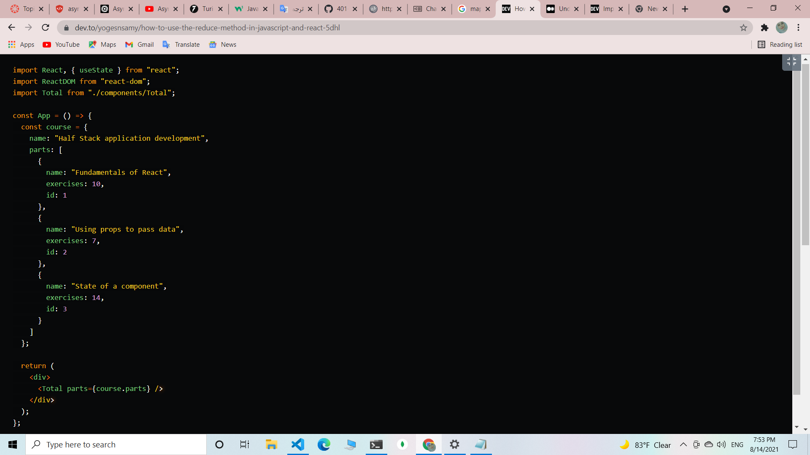

# Review

# map method :

The JavaScript Map method iterates over every element in an array and returns a new array with the result. The .map() and .forEach() methods appear to have the same functionality; the key difference is .map() ability to return a new a new array.

The .map() method does not change the original array.

# reduce method

In the above example the summer function is called the reducer. On each iteration of the reducer function we iterate over the current value and add it to the accumulator value returned in the last iteration.

The reducer function takes in 4 parameters: * the accumulator value - which is the result of the operation in the body of the reducer from the last iteration or the initial value in the first iteration * the current value - the current item over which we are iterating * the current index - the current index of the item we are iterating over * the source array - the array we are iterating over.

Using reduce in React

Imagine you have the following data structure in the App component:

   .png)

  **To display the total number of exercises in in the Total component:**

from App send parts as a prop to Total:

in Total, call the reduce method on parts.

parts contains multiple values name, exercises and id.

so we explicitly specify exercises as the value we want to use in the calculation.

import React, { useState } from "react";

import ReactDOM from "react-dom";

import Total from "./components/Total";

.png)

## Result 

# superagent
SuperAgent is light-weight progressive ajax API crafted for flexibility,

readability, and a low learning curve after being frustrated with many of the 

existing request APIs. It also works with Node.js!

.then() 

A promise says, “Hey, Javascript, you go ahead and do some work. I don’t care how long it takes and I’m going to go ahead and keep working … but let me know when you’re done .then() give me the data and let me deal with it myself”

async / await

promises, although a big improvement over Callbacks for asynchronous functionality, still have a slightly messy syntax that can be confusing, especially when nesting. With ES6, Javascript introduced the async / await pattern to add even more syntactic sugar on promises.

Here’s a simple function that returns a promise, and a standard call that invokes that function, and uses .then() and .catch() to interact with it.