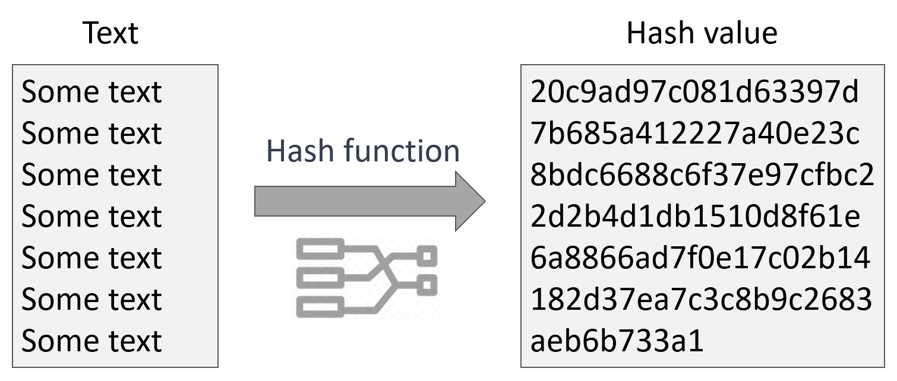

Definition: A hash function is a function that takes a set of inputs of any arbitrary size and fits them into a table or other data structure that contains fixed-size elements.

 

Definition: A hash is a value in the table or data structure generated by the hash function used to generate that particular table or data structure. The table or data structure generated is usually called a hash table. It is also generally assumed that the time complexity of accessing data in a hash table is O(1), or constant.

The benefit of hashing is that if someone steals the database with hashed passwords, they only make off with the hashes and not the actual plaintext passwords. 

PROBLEMS WITH CRYPTOGRAPHIC HASH ALGORITHM

Brute Force attack: Hashes can't be reversed, so instead of reversing the hash of the password, an attacker can simply keep trying different inputs until he does not find the right now that generates the same hash value, called brute force attack.

Hash Collision attack: Hash functions have infinite input length and a predefined output length, so there is inevitably going to be the possibility of two different inputs that produce the same output hash. MD5, SHA1, SHA2 are vulnerable to Hash Collision Attack i.e. two input strings of a hash function that produce the same hash result.

BCrypt, IT's SLOW AND STRONG AS HELL
To overcome such issues, we need algorithms which can make the brute force attacks slower and minimize the impact. Such algorithms are PBKDF2 and BCrypt, both of these algorithms use a technique called Key Stretching.

**Authentication**

a way to identify  the person using username & password 

**Session Management**

 is a process by which a server maintains the state of an entity interacting with it. This is required for a server to remember how to react to subsequent requests throughout a transaction. Sessions are maintained on the server by a session identifier which can be passed back and forward between the client and server when transmitting and receiving requests. Sessions should be unique per user and computationally very difficult to predict. 

**node.bcrypt.js**

A library to help you hash passwords.

**In computer programming hash functions map text (or other data) to integer**
 numbers. Usually different inputs maps to different outputs, but sometimes a collision may happen (different input with the same output).
Cryptographic hash functions transform text or binary data to fixed-length hash value and are known to be collision-resistant and irreversible. Example of cryptographic hash function is SHA3-256:

**engineering**

In software engineering, the singleton pattern is a software design pattern that restricts the instantiation of a class to one "single" instance. This is useful when exactly one object is needed to coordinate actions across the system. The term comes from the mathematical concept of a singleton

**Intent**
Ensure a class has only one instance, and provide a global point of access to it.
Encapsulated "just-in-time initialization" or "initialization on first use".

**problem**

Application needs one, and only one, instance of an object. Additionally, lazy initialization and global access are necessary.

Make the class of the single instance object responsible for creation, initialization, access, and enforcement. Declare the instance as a private static data member. Provide a public static member function that encapsulates all initialization code, and provides access to the instance.

**Singleton should be considered only if all three of the following criteria are** **satisfied**:

Ownership of the single instance cannot be reasonably assigned
Lazy initialization is desirable
Global access is not otherwise provided for

Explain how the Singleton pattern can be used with Node modules, specifically with classes ?

All implementations of the Singleton have these two steps in common:

Make the default constructor private, to prevent other objects from using the new operator with the Singleton class.

Create a static creation method that acts as a constructor. Under the hood, this method calls the private constructor to create an object and saves it in a static field. All following calls to this method return the cached object.

If your code has access to the Singleton class, then it’s able to call the Singleton’s static method. So whenever that method is called, the same object is always returned.

If you were tasked with building a middleware system like Express uses, what approach might you take to construct/operate it?

npm init

npm install express --save

Create server.js and paste the following code:

const express = require('express');
const app = express();

app.get('/', (req, res, next) => {
  res.send('Welcome Home');
});

app.listen(3000);

const express = require('express');
const app = express();

const requireJsonContent = () => {

  return (req, res, next) => {
      
    if (req.headers['content-type'] !== 'application/json') {

        res.status(400).send('Server requires application/json')

    } else {

      next()

    }

  }

}

app.get('/', (req, res, next) => {

  res.send('Welcome Home');

});

app.post('/', requireJsonContent(), (req, res, next) => {

  res.send('You sent JSON');

})
